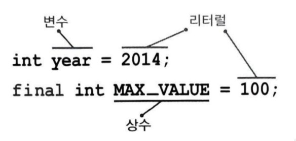
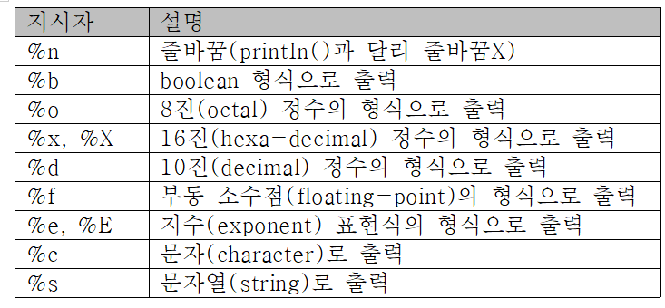
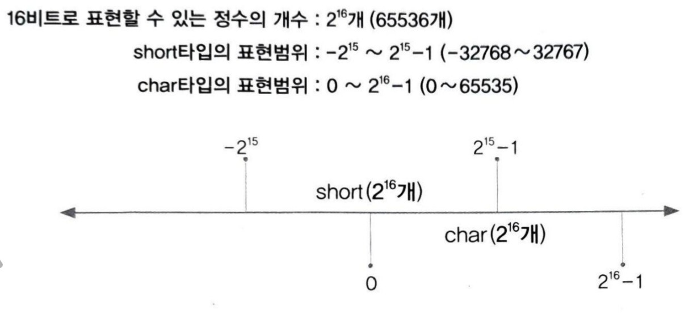
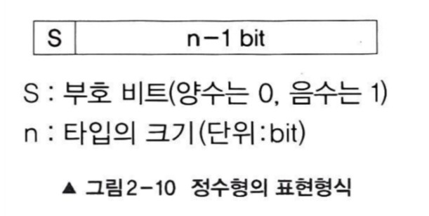
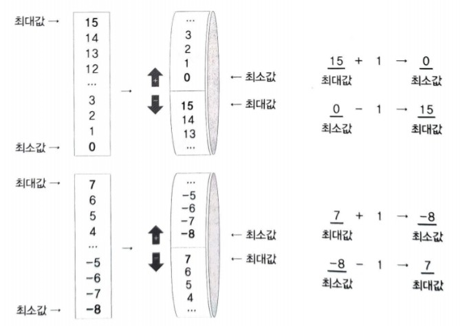
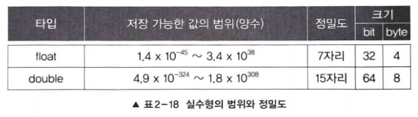
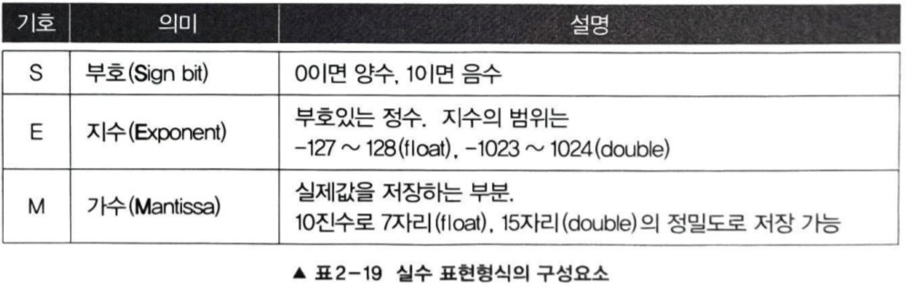
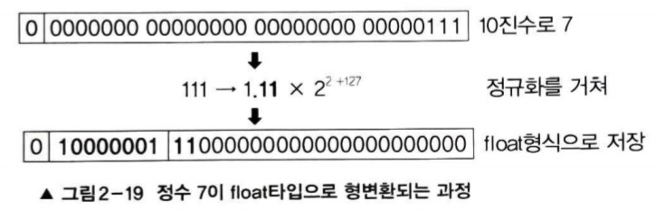
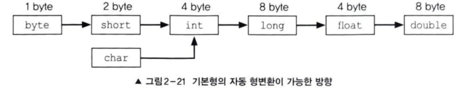

## 변수
### 변수란?
- 단 하나의 값을 저장할 수 있는 공간

### 변수 선언과 초기화
- 변수를 선언하면, 메모리의 빈 공간에 변수타입에 알맞는 크기의 저장공간이 확보되고, 변수이름을 통해 사용할 수 있음
- 변수에는 다른 프로그램에 의해 저장된 '알 수 없는 값'이 남아있을 수 있기 때문에 적절한 값으로 초기화하는 것이 좋음
- 예제 2-1/Ch02_VarEx1

###  변수의 명명 규칙
- 프로그래밍에서 사용하는 모든 이름을 '식별자'라고 하며 같은 영역 내에서 서로 구분될 수 있어야함
>#### 1. 대소문자가 구분되며 길이에 제한이 없다.
>#### 2. 예약어를 사용해서는 안 된다.
>- true는 예약어라 사용할 수 없지만, True는 가능하다.
>#### 3. 숫자로 시작해서는 안 된다.
>#### 4. 특수문자는 '_'와 '$'만을 허용한다.

### 권장사항(필수X)
>#### 1. 클래스 이름의 첫 글자는 항상 대문자로 한다.
> - 변수와 메서드 이름의 첫 글자는 항상 소문자로
> #### 2. 여러 단어 이름은 단어의 첫 글자를 대문자로 한다.
> #### 3. 상수의 이름은 대문자로 하며 단어는 '_'로 구분한다.
> - ex) MAX_NUMBER

### 변수의 타입
+ 값은 문자와 숫자(정수&실수)로 나뉨
+ boolean을 제외한 기본형은 서로 연산과 변환이 가능

> ### 2.1 기본형
> + 실제 값을 저장
> > #### 논리형(boolean)
> > + true와 false 중 하나를 값으로 갖으며, 조건신과 논리적 계산에 사용됨
> >#### 문자형(char)
> > + 문자를 저장하는데 사용되며, 변수에 하나의 문자만 저장할 수 있음
> > #### 정수형(byte, short, int, long)
> > + 주로 int(CPU에 효율적)가 사용되며, byte는 이진데이터를 다룰 때 사용되며, short는 C언어와의 호환을 위해서 추가되었음
> > #### 실수형(float, double)
> > + 주로 double이 사용됨
> >  
### - 참조형
+ 8개의 기본형을 제외한 나머지 타입
+ 객체의 주소를 저장

### 상수
+ 한번 값을 저장하면 변경할 수 없는 저장 공간
+ 변수의 타입 앞에 키워드 'final'을 붙여줌
> + final int MAX_SPEED = 10; //상수 MY_SPEED를 선언 & 초기화
+ 반드시 선언과 동시에 초기화 해야함
+ 필요 이유?
+ 여러 곳을 수정할 필요없이 상수의 초기화만 다른 값으로 해주면 됨
### 리터럴 
+ 그 자체로 값을 의미하는 것

### 리터럴 타입과 접미사
#### - 정수형, 실수형에는 여러 타입 존재, 리터럴에 접미사를 붙여서 타입을 구분
+ 정수형에서는 long 타입의 리터럴에 접미사 'l','L'을 붙이고
+ 접미사가 없으면 int 타입의 리터럴
+ 실수형에서는 float 타입의 리터럴에 'f','F'를 붙이고
+ double이 실수형의 기본 자료형이라서 접미사'd'는 생략이 가능
> + float pi = 3.14f;
+ 타입이 달라도 저장범위가 넓은 타입에 좁은 타입의 값을 저장하는 것은 허용됨

### 형식화된 출력 - printf()
+ 같은 값이라도 다른 형식으로 출력하고 싶을 때 사용
+ 지시자를 통해 변수의 값을 여러 가지 형식으로 변환하여 출력
+ 자주 사용하는 지시자

### 화면에서 입력받기 - Scanner
+ 먼저 Scanner 클래스를 사용하려면, 아래 문자을 추가해줘야 함
> import java.util.*;
+ *예제 Ch02.Ch2_ScannerEx.java 
+ 메서드 nextLine() - 입력대기 상태에 있다가 입력을 마치고 엔터키를 누르면 입력한 내용이 문자열로 반환됨
+ 메서드 Integer.parseInt() - 입격받은 분자열을 숫자로 변환

### 논리형 - boolean
+ 기본값(Default)은 false
+ 대답(yes/no), 스위치(on/off)등의 논리구현에 주로 사용

### 문자형 - char
+ 단 하나의 문자만을 저장할 수 있음
+ 컴퓨터는 숫자밖에 모르기 때문에 모든 데이터를 숫자로 변환하여(유니코드) 저장
+ 유니코드 직접 저장 가능
#### char타입의 표현형식
+ char 타입의 크기는 2 byte(=16 bit)
+ 2^16개의 코드를 사용할 수 있음
+ 정수형과 달리 음수를 나타낼 필요가 없으므로 표현할 수 있는 값의 범위가 다름
+ short은 절반을 음수표현에 사용

### 정수형 - byte, short, int, long
+ 기본 자료형은 int
+ 어떤 진법의 리터럴을 변수에 저장해도 실제로는 2진수로 바뀌어 저장됨
+ 
+ 모든 정수형은 부호있는 정수이므로 왼쪽 첫 번째 비트를 '부호 비트'로 사용하고
+ 나머지는 값을 표현하는데 사용함
+ n비트로 표현할 수 있는 부호있는 정수의 범위: -2^n-1~2^(n-1)-1
+ 최대 값에서 1을 빼는 이유는 범위에 0이 포함되기 때문

#### 정수형의 오버플로우 
+ 연산과정에서 해당 타입이 표현할 수 있는 값을 넘어서는 것
> - 정수형 타입이 표현할 수 있는 최대값 + 1 -> 최소값
> - 최소값 + 1 -> 최대값
+ #### 부호 있는 정수의 오버플로우
+ 부호 있는 정수는 부호비트가 0에서 1일 될 때 오버플로우가 발생함

+ 부호 없는 정수(4 bit)의 경우 표현범위가 '0~15'이므로 이 값이 계속 반복
+ 부호 있는 정수의 표현범위가 '-8~7'이므로 이 값이 무한히 반복

#### 실수형 - float, double

#### 실수형의 범위와 정밀도
+ 양의 범위만 적은 것으로 '-'부호를 붙이면 음의 범위
+ 2의 제곱을 곱한 형태로 저장하기 때문에 큰 범위의 값을 저장 가능
+ 오차가 발생할 수 있기에 정밀도가 중요한 요소
+ 예제 Ch02.Ch2_FloatEx1 
#### 실수형의 저장형식
+  실수형은 값을 부동소수점수의 형태로 저장
+  부동소수점수는 부호, 지수, 가수 세 부분으로 이루어져 있음

+ 부호(1 bit), 지수(8 bit)

### 형변환
+ 변수 또는 상수의 타입을 다른 타입으로 변환하는 것이면 캐스팅이라고도 함
+ > (타입)피연산자
+ 괄호()는 '캐스트 연산자'또는 '형변환 연산자'라고 함
+ 예제 Ch02.Ch2_CastingEx1

#### 정수형간의 형변환
+ 큰 타입에서 작은 타입으로의 변환 -> 크기의 차이만큼 잘려나가서 값 손실 발생
+ 작은 타입에서 큰 타입으로의 변환 -> 값 손실 발생 X
+ 변환하려는 값이 음수인 경우, 빈 공간을 1로 채움

#### 실수형 간의 형변환
+ float 타입 -> double 타입
+ float의 가수 23자리를 채우고 남은 자리를 0으로 채움
+ double -> float
+ 가수(M)는 52자리 중 23자리만 저장되고 나머지는 버려짐
+ 반올림 발생
+ float타입의 범위를 넘는 값을 float으로 형변환 하는 경우
+ +-무한대 또는 +-0을 결과로 얻음

#### 정수형과 실수형 간의 형변환
+ 정수형과 실수형은 저장형식이 완전히 다름
> 정수형을 실수형으로 변환
+ 정수를 2진수로 변환한 후 정규화를 거쳐 실수의 저장형식으로 저장

+ 실수형의 정밀도 제한으로 인한 오차가 발생할 수 있음
+ -> 10진수로 8자리 이상의 값을 실수형으로 변환할 때는 double로 형변환을 해야 오차 발생X
> 실수형을 정수형으로 변환
+ 실수형을 정수형으로 변환하면, 정수형의 표현형식으로 소수점 이하의 값은 표현할 수 없기 때문에
  실수형의 소수점이하 값은 버려짐
+ 반올림 발생 X
+ 예제 Ch02.Ch2_CastingEx4

### 자동 형변환
+ 경우에 따라 편의상의 이유로 형변환을 생략할 수 있음
+ 컴파일러가 생략된 형변환을 자동적으로 추가함
> float f = 1234; // 형변환의 생략. float f = (float)1234;와 같음
+ 계산식에서도 자주 형변환이 생략되는데
+ 서로 다른 두 타입의 연산에서는 타입을 일치시킨 다음에 연산을 수행해야 하므로,
+ 연산과정에서 형변환이 자동적으로 이루어짐
> int i = 3;
> double d = 1.0 + i; // double d = 1.0 + (double)i;에서 형변환이 생략됨

#### 자동 형변환의 규칙
+ 기존의 값을 최대한 보존할 수 있는 타입으로 자동 형변환함
+ 두 타입 중 표현 범위가 더 넓은 쪽으로 형변환됨
+ 반대로의 형변환은 반드시 형변환 연산자를 써줘야 함
  

1. boolean을 제외한 나머지 7개의 기본형은 서로 형변환이 가능함
2. 기본형과 참조형은 서로 형변환할 수 없음
3. 서로 다른 타입의 변수간의 연산은 형변환을 하는 것이 원칙이지만, 값의 범위가 작은 타입에서 큰 타입으로의 형변환은 생략할 수 있음
