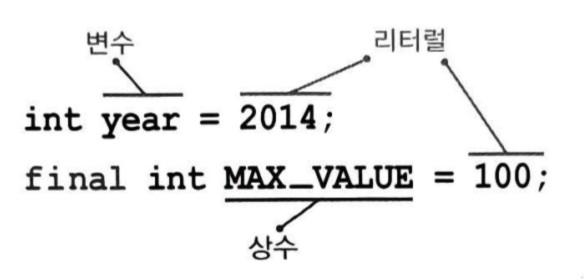
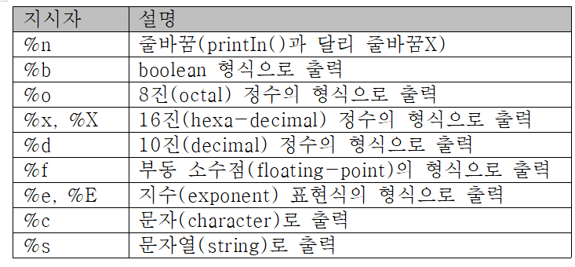
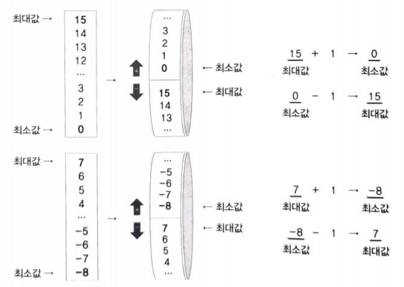
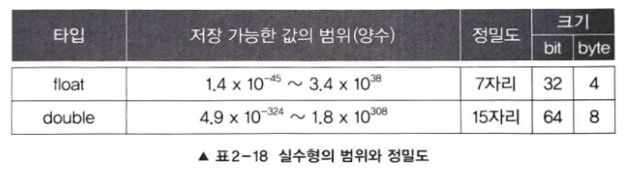

## 변수
### 변수란?
- 단 하나의 값을 저장할 수 있는 공간

### 변수 선언과 초기화
- 변수를 선언하면, 메모리의 빈 공간에 변수타입에 알맞는 크기의 저장공간이 확보되고, 변수이름을 통해 사용할 수 있다.
- 변수에는 다른 프로그램에 의해 저장된 '알 수 없는 값'이 남아있을 수 있기 때문에 적절한 값으로 초기화하는 것이 좋다.
- 예제 2-1/Ch02_VarEx1

### 명명 규칙
- 프로그래밍에서 사용하는 모든 이름을 '식별자'라고 하며 같은 영역 내에서 서로 구분될 수 있어야한다.
>#### 1. 대소문자가 구분되며 길이에 제한이 없다.
>#### 2. 예약어를 사용해서는 안 된다.
>- true는 예약어라 사용할 수 없지만, True는 가능하다.
>#### 3. 숫자로 시작해서는 안 된다.
>#### 4. 특수문자는 '_'와 '$'만을 허용한다.

### 권장사항(필수X)
>#### 1. 클래스 이름의 첫 글자는 항상 대문자로 한다.
> - 변수와 메서드 이름의 첫 글자는 항상 소문자로
> #### 2. 여러 단어 이름은 단어의 첫 글자를 대문자로 한다.
> #### 3. 상수의 이름은 대문자로 하며 단어는 '_'로 구분한다.
> - ex) MAX_NUMBER

### 변수의 타입
+ 값은 문자와 숫자(정수&실수)로 나뉨
+ boolean을 제외한 기본형은 서로 연산과 변환이 가능

> ### - 기본형
> + 실제 값을 저장
> > #### 논리형(boolean)
> > + true와 false 중 하나를 값으로 갖으며, 조건신과 논리적 계산에 사용됨
> >#### 문자형(char)
> > + 문자를 저장하는데 사용되며, 변수에 하나의 문자만 저장할 수 있음
> > #### 정수형(byte, short, int, long)
> > + 주로 int(CPU에 효율적)가 사용되며, byte는 이진데이터를 다룰 때 사용되며, short는 C언어와의 호환을 위해서 추가되었음
> > #### 실수형(float, double)
> > + 주로 double이 사용됨
> >  
### - 참조형
+ 8개의 기본형을 제외한 나머지 타입
+ 객체의 주소를 저장

### 상수
+ 한번 값을 저장하면 변경할 수 없는 저장 공간
+ 변수의 타입 앞에 키워드 'final'을 붙여줌
> + final int MAX_SPEED = 10; //상수 MY_SPEED를 선언 & 초기화
+ 반드시 선언과 동시에 초기화 해야함
+ 필요 이유?
+ 여러 곳을 수정할 필요없이 상수의 초기화만 다른 값으로 해주면 됨
### 리터럴 
+ 그 자체로 값을 의미하는 것

### 리터럴 타입과 접미사
#### - 정수형, 실수형에는 여러 타입 존재, 리터럴에 접미사를 붙여서 타입을 구분
+ 정수형에서는 long 타입의 리터럴에 접미사 'l','L'을 붙이고
+ 접미사가 없으면 int 타입의 리터럴
+ 실수형에서는 float 타입의 리터럴에 'f','F'를 붙이고
+ double이 실수형의 기본 자료형이라서 접미사'd'는 생략이 가능
> + float pi = 3.14f;
+ 타입이 달라도 저장범위가 넓은 타입에 좁은 타입의 값을 저장하는 것은 허용됨

### 문자 리터럴과 문자열 리터럴
+ 문자 하나를 작은 따옴표로 감싼 것 -> 문자 리터럴
+ 두 문자 이상 큰 따옴표로 -> 문자열 리터럴
+ 문자 리터럴은 반드시 ''안에 하나의 문자가 있어야함
+ 덧셈 연산자(+)는 피연산자 중 어느 한 쪽이 String이면 나머지 한 쪽을 먼저 String으로 면환한 다음 두 String을 결합함
> + 문자열 + any type -> 문자열 + 문자열 -> 문자열
+ 결합순서에 따라 결과가 달라짐
+ 예제 Ch2_StringEx

### 형식화된 출력 - printf()
+ 같은 값이라도 다른 형식으로 출력하고 싶을 때 사용
+ 지시자를 통해 변수의 값을 여러 가지 형식으로 변환하여 출력
+ 자주 사용하는 지시자

+ 예제 Ch2_PrintfEx1
+ 예제 Ch2_PrintfEx2
+ %g: 실수의 길이에 따라 %f or %e의 방식으로 출력

### 화면에서 입력받기 - Scanner
+ 먼저 Scanner 클래스를 사용하려면, 아래 문자을 추가해줘야 함
> import java.util.*;
+ *예제 Ch2_ScannerEx.java 
+ 메서드 nextLine() - 입력대기 상태에 있다가 입력을 마치고 엔터키를 누르면 입력한 내용이 문자열로 반환됨
+ 메서드 Integer.parseInt() - 입격받은 분자열을 숫자로 변환

### 논리형 - boolean
+ 기본값(Default)은 false
+ 대답(yes/no), 스위치(on/off)등의 논리구현에 주로 사용

### 문자형 - char
+ 단 하나의 문자만을 저장할 수 있음
+ 컴퓨터는 숫자밖에 모르기 때문에 모든 데이터를 숫자로 변환하여(유니코드) 저장
+ 유니코드 직접 저장 가능
#### char타입의 표현형식
+ char 타입의 크기는 2 byte(=16 bit)
+ 2^16개의 코드를 사용할 수 있음
+ 정수형과 달리 음수를 나타낼 필요가 없으므로 표현할 수 있는 값의 범위가 다름
+ short은 절반을 음수표현에 사용
+ 

#### 특수문자 저장
+ 
+ 예제 Ch2_SpecialCharEx

#### 인코딩과 디코딩

+ 문자를 저장할 때는 인코딩을 해서 숫자로 변환해서 저장하고
  저장된 문자를 읽어올 때는 디코딩을 해서 숫자를 원래의 문자로 되돌려야함

#### 아스키(ASCII)
+ 정보교환을 위한 미국 표준 코드
+ 128개(2^7)의 문자 집합을 제공하는 7 bit 부호
+ 숫자 '0~9', 영문자 'A~Z'와 'a~z'가 연속적으로 배치되어 있음

#### 확장아스키
+ 데이터는 byte단위로 다뤄지는데 아스키는 7 bit이므로 1 bit가 남음
+ 이 공간을 무자로 추가로 정의한 것이 확장 아스키
+ 여러 국가와 기업에서 서로의 필요에 따라 다르게 정의해서 사용

#### 유니코드
+ 전 세계의 모든 문자를 하나의 통일한 문자집합
+ 문자 셋(캐릭터 셋): 유니코드에 포함시키고자 하는 문자들의 집합
+ 문자 셋에 번호를 붙인 것이 유니코드 인코딩이고 자바에서는 UTF-16을 사용
+ UTF-16은 문자를 다루기는 편리하지만 문서의 크기가 커진다는 단점이 있음

### 정수형 - byte, short, int, long
+ 기본 자료형은 int
+ 어떤 진법의 리터럴을 변수에 저장해도 실제로는 2진수로 바뀌어 저장됨
+ 
+ 모든 정수형은 부호있는 정수이므로 왼쪽 첫 번째 비트를 '부호 비트'로 사용하고
+ 나머지는 값을 표현하는데 사용함
+ n비트로 표현할 수 있는 부호있는 정수의 범위: -2^n-1~2^(n-1)-1
+ 최대 값에서 1을 빼는 이유는 범위에 0이 포함되기 때문

#### 정수형의 선택기준
+ 정수형 변수를 선언할 때는 int 타입으로 하고, 
+ int의 범위(약 20억)를 넘어서는 수를 다뤄야할 때는 long을 사용하면 됨

#### 정수형의 오버플로우 
+ 연산과정에서 해당 타입이 표현할 수 있는 값을 넘어서는 것
> - 정수형 타입이 표현할 수 있는 최대값 + 1 -> 최소값
> - 최소값 + 1 -> 최대값
+ #### 부호 있는 정수의 오버플로우
+ 부호 있는 정수는 부호비트가 0에서 1일 될 때 오버플로우가 발생함
+ 
+ 부호 없는 정수(4 bit)의 경우 표현번위가 '0~15'이므로 이 값이 계속 반복
+ 부호 있는 정수의 표현범위가 '-8~7'이므로 이 값이 무한히 반복
+ 예제 Ch2_OverflowEx

#### 실수형 - float, double

#### 실수형의 범위와 정밀도
+ 양의 범위만 적은 것으로 '-'부호를 붙이면 음의 범위
+ 2의 제곱을 곱한 형태로 저장하기 때문에 큰 범위의 값을 저장 가능
+ 오차가 발생할 수 있기에 정밀도가 중요한 요소
+ float 타입은 7자리의 10진수를 오차없이 저장 가능
+ 예제 Ch2_FloatEx1 
#### 실수형의 저장형식
+  실수형은 값을 부동소수점수의 형태로 저장
+  부동소수점수는 부호, 지수, 가수 세 부분으로 이루어져 있음

+ 부호(1 bit)
+ 지수(8 bit)
