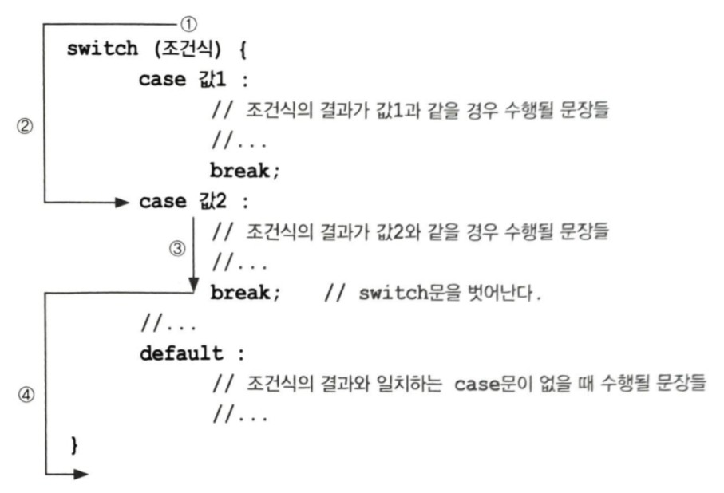

## 1. 조건문 - if , switch
+ 조건에 따라 다른 문장이 수행되도록 함
### 1.1 if문
+ '조건식'과 '괄호{}'로 이루어져 있음
+ '만일(if) 조건식이 참(true)이면 괄호 {}안의 문장들을 수행하라'라는 의미
<pre>if (조건식) {
            // 조건식이 참(true)일 때 수행될 문장들을 적음
}</pre>
+ 조건식 'score > 60'이 참(true)이면 괄호 {} 안의 문장이 수행되어 화면에
  "합격입니다."라고 출력되고 거짓(false)이면, if문 다음의 문장으로 넘어감
<pre>if (score > 60) {
            System.out.println("합격입니다.");
}</pre>
+ 조건식의 결과는 반드시 true 또는 false
+ 블럭(block): 괄호 {}를 이용해서 여러 문장을 하나의 단위로 묶는 것
+ 블럭이 하나인 경우 생략 가능

### 1.2 if-else문
+ if문에 'else블럭'이 더 추가되었음
<pre>if (조건식) {
            // 조건식이 참(true)일 때 수행될 문장들을 적음
} else {
      //조건식이 거짓(false)일 때 수행될 문장들을 적음
}</pre>

### 1.3 if-else if문
+ 한 문장에 여러 개의 조건식을 쓸 수 있음
<pre>if (조건식1) {
          // 조건식1의 연산결과가 참일 때 수행될 문장들을 적음
} else if (조건식2) {
     // 조건식2의 연산결과가 참일 때 문장을 수행하고 if-else if문 전체를 빠져나옴
} else if (조건식3) { // 여러 개의 else if를 사용할 수 있음
        // 조건식3의 연산결과가 참일 때 수행될 문장들을 적음
} else { //마지막에는 보통 else블럭으로 끝나며, else블럭은 생략가능
      // 위의 어느 조건식도 만족하지 않을 때 수행될 문장을 적음
}
</pre>

### 1.4 중첩 if문
+ if문의 블럭 내에 또 다른 if문을 포함시키는 것
<pre>if (조건식1) {
              //조건식1의 연산결과가 true일 때 수행될 문장들
      if (조건식2) {
              //조건식1과 조건식2가 모두 true일 때 수행될 문장들
      } else {
              //조건식1이 true고, 조건식2가 false일 때 수행되는 문장들
} else {
      //조건식1이 false일 때 수행되는 문장들</pre>
+ 바깥쪽의 if문과 안쪽의 if문이 서로 엉킬 수 있기 때문에 괄호{}의 생략에 더욱 조심해야함

### 1.5 switch문
+ 단 하나의 조건식으로 많은 경우의 수를 처리할 수 있고 표현도 간결하므로 알아보기 쉬움
+ 처리할 경우의 수가 많은 경우

1) 조건식을 계산함
2) 조건식의 결과와 일치하는 case문으로 이동
3) 이후 문장들을 수행
4) break문이나 switch문의 끝을 만나면 switch문 전체를 빠져나감
+ 만약 조건식의 결과와 일치하는 case문이 하나도 없으면 default문으로 이동함
<pre>switch (level) {
      case 3:
            grantDelete(); //삭제권한을 줌
      case 2:
            grantWrite(); //쓰기권한을 줌
      case 1:
            grantRead(); //읽기권한을 줌</pre>
+ 로그인한 사용자의 등급을 체크하여 등급에 맞는 권한을 부여하는 방식

#### switch문의 제약조건
1. switch문의 조건식 결과는 정수 또는 문자열이어야 함
2. case문의 값은 정수 상수만 가능하며, 중복되지 않아야 함

#### switch문의 중첩
+ switch문에서 break문을 빼먹기 쉬움