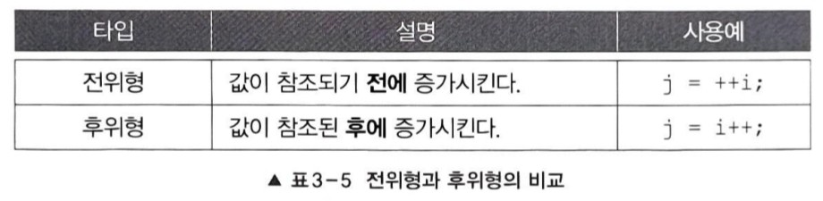

## 1. 연산자
### 1.1 연산자와 피연산자
+ 연산자
  + 연산을 수행하는 기호(+,-,*,/ 등)
+ 피연산자
  + 연산자의 작업 대상(변수, 상수, 리터럴, 수식)
>x+3
+ 연산자는 피연산자로 연산을 수행하고 나면 항상 결과값을 반환함

### 1.2 식과 대입연산자
+ 식
  + 연산자와 피연산자를 조합하여 계산하고자하는 바를 표현한 것
+ ~~대입연산자 '='를 사용해서 변수와 같이 값을 저장할 수 있는 공간에 결과를 저장해야함~~
+ 값을 다른 곳에 사용하지 않을 것이면 println 메서드의 괄호()안에 직접 식을 써도 됨
<pre>
System.out.println(4 * x + 3);
</pre>

### 1.3 연산자의 종류

+ 피연산자의 개수로 연산자를 분리하기도 한다
  + 1개면 단항 연산자, 2개면 이항 연산자, 3개면 삼항 연산자( 오직'?:')

### 1.4 연산자의 우선순위와 결합규칙
+ 식에 사용된 연산자가 둘 이상인 경우, 연산자의 우선순위에 의해서 연산순서가 결정됨

#### 연산자의 결합규칙
+ 우선순위가 같으면 연산자의 결합규칙대로 연산을 수행
+ 대부분은 왼쪽 -> 오른쪽 순서로 연산 수행 
+ 단항 연산자와 대입 연산자만 그 반대로 연산을 수행

#### 연산자의 우선순위
1. 산순 > 비교 > 논리 > 대입, 대입은 제일 마지막에 수행됨
2. 단항(1) > 이항(2) > 삼항(3), 단항 연산자의 우선순위가 이항 연산자보다 높음
3. 단항 연산자와 대입 연산자를 제외한 모든 연산의 진행방향은 왼쪽에서 오른쪽

### 1.5 산술 변환
+ 연산 전에 피연산자 타입의 일치를 위해 자동 형변환되는 것
+ 
  + 1 피연산자의 값손실 최소화하기 위한 것
  + 2 가장 효율적으로 처리할 수 있는 타입인 int를 사용함으로서 연산중에 오버플로우가 발생할 가능성이 줄이기 위한 것

## 2. 단항 연산자
### 2.1 증감 연산자 ++ --
+ 증가 연산자(++) 피연산자의 값을 1 증가 시킴
+ 감소 연산자(--) 피연산자의 값을 1 감소 시킴

+ 예제 Ch3_OperatorEx2