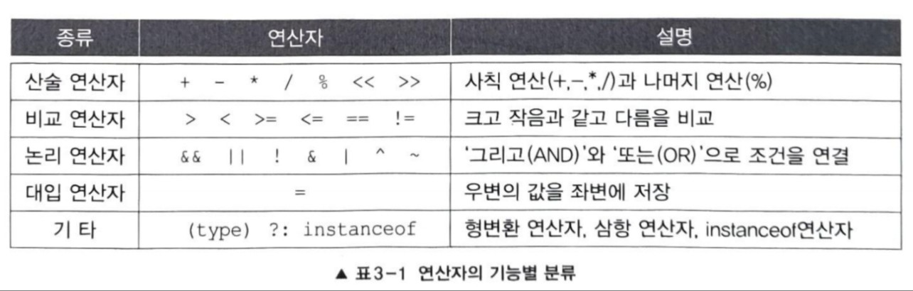
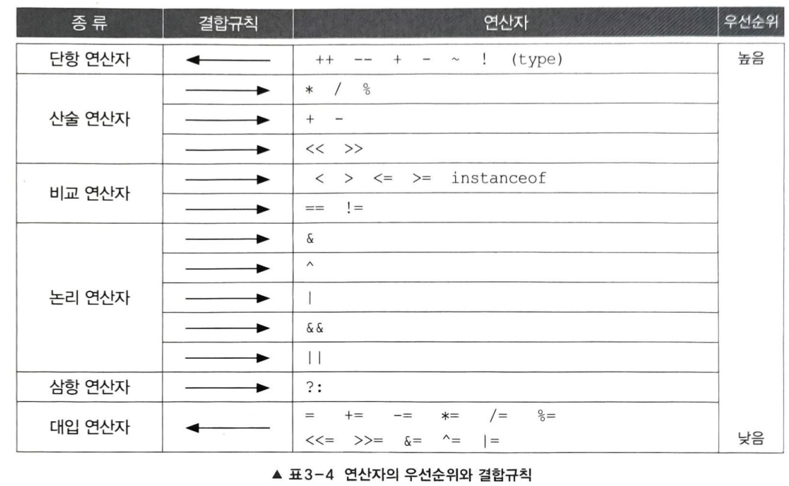
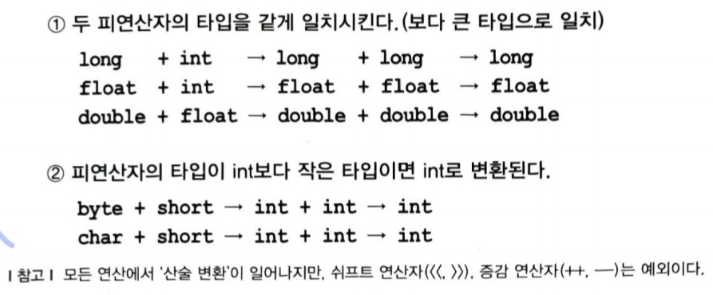
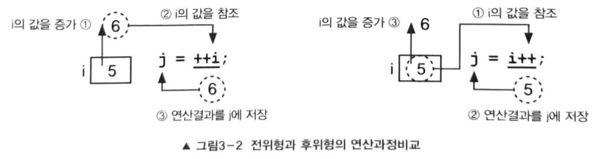
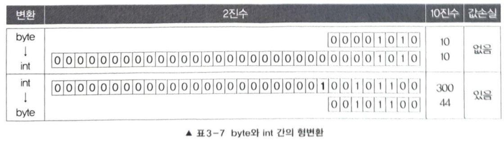
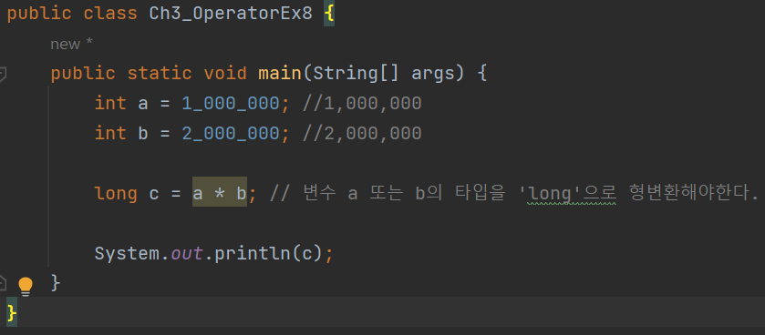
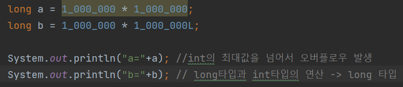

## 1. 연산자
### 1.1 연산자와 피연산자
+ 연산자
  + 연산을 수행하는 기호(+,-,*,/ 등)
+ 피연산자
  + 연산자의 작업 대상(변수, 상수, 리터럴, 수식)
>x+3
+ 연산자는 피연산자로 연산을 수행하고 나면 항상 결과값을 반환함

### 1.2 식과 대입연산자
+ 식
  + 연산자와 피연산자를 조합하여 계산하고자하는 바를 표현한 것
+ ~~대입연산자 '='를 사용해서 변수와 같이 값을 저장할 수 있는 공간에 결과를 저장해야함~~
+ 값을 다른 곳에 사용하지 않을 것이면 println 메서드의 괄호()안에 직접 식을 써도 됨
<pre>
System.out.println(4 * x + 3);
</pre>

### 1.3 연산자의 종류

+ 피연산자의 개수로 연산자를 분리하기도 한다
  + 1개면 단항 연산자, 2개면 이항 연산자, 3개면 삼항 연산자( 오직'?:')

### 1.4 연산자의 우선순위와 결합규칙
+ 식에 사용된 연산자가 둘 이상인 경우, 연산자의 우선순위에 의해서 연산순서가 결정됨

#### 연산자의 결합규칙
+ 우선순위가 같으면 연산자의 결합규칙대로 연산을 수행
+ 대부분은 왼쪽 -> 오른쪽 순서로 연산 수행 
+ 단항 연산자와 대입 연산자만 그 반대로 연산을 수행

#### 연산자의 우선순위
1. 산순 > 비교 > 논리 > 대입, 대입은 제일 마지막에 수행됨
2. 단항(1) > 이항(2) > 삼항(3), 단항 연산자의 우선순위가 이항 연산자보다 높음
3. 단항 연산자와 대입 연산자를 제외한 모든 연산의 진행방향은 왼쪽에서 오른쪽

### 1.5 산술 변환
+ 연산 전에 피연산자 타입의 일치를 위해 자동 형변환되는 것
+ 
  + 1 피연산자의 값손실 최소화하기 위한 것
  + 2 가장 효율적으로 처리할 수 있는 타입인 int를 사용함으로서 연산중에 오버플로우가 발생할 가능성이 줄이기 위한 것

## 2. 단항 연산자
### 2.1 증감 연산자 ++ --
+ 증가 연산자(++) 피연산자의 값을 1 증가 시킴
+ 감소 연산자(--) 피연산자의 값을 1 감소 시킴
+ 전위형: 값이 참조되기 전에 증가시킴 ex) j = ++i;
+ 후위형: 값이 참조된 후에 증가시킴 ex) j = i++;
+ 예제 Ch03.Ch3_OperatorEx2
+ 
+ ~~식에 두 번 이상 포함된 변수에 증감연산자를 사용하는 것은 피해야함~~

### 2.2 부호 연산자 + -
+ 부호 연산자'-'는 피연사자의 부호를 반대로 변경한 결과를 반환함
+ 부호 연산자는 boolean형과 char 형을 제외한 기본형에만 사용 가능

## 3. 산술 연산자
### 3.1 사칙 연산자 + - * /
+ 곱셈(*), 나눗셈(/), 나머지(%) 연산자가 덧셈(+), 뺄셈(-)연산자보다 우선순위가 높으므로 먼저 처리됨
+ 피연산자가 정수형인 경우, 나누는 수로 0을 사용하면 에러가 발생함
+ int 타입은 소수점을 저장하지 못하므로 정수만 남고 소수점 이하는 버려진다.
+ 따라서 올바른 연산결과를 얻기 위해서는 두 피연산자 중 어느 한 쪽을 실수형으로 형변환해야됨
~~+ 정수형 피연산자를 0으로 나누면, 실행시 오류가 발생~~
~~+ 부동소수점값인 0.0f, 0.0d로 나누면 그 결과로 Infinity(무한대)가 나옴~~
+ * 예제 Ch_OperatorEx6
  + 'a+b'의 연산결과는 byte형이 아닌 int형(4 byte)이기에 1byte 변수에 형변환없이 저장하려고 했기 때문에 에러 발생

+ byte 형의 범위인 '-128~127'의 범위를 넘는 int형의 값을 byte형으로 변환하면 원래의 값이 보존되지 않고 byte형의 범위 중 한 값을 갖게 된다.

+ 이미 int타입의 값이 결과이므로 자동 형변환되어도 값은 변하지 않는다.

+ int의 최대값인 약 2*10^9을 넘으므로 오버플로우 발생

### 3.2 나머지 연산자 %
+ 왼쪽의 피연산자를 오른족 피연산자로 나누고 난 나머지 값을 결과로 반환하는 연산자
+ 나머지 연산자(%)는 나누는 수로 음수도 허용함
+ 나머지 연산한 결과에 왼쪽 피연산자의 부호를 붙이면 됨
+ 예제 Ch03.Ch3_OperatorEx20

## 4. 비교연산자
+ 두 피연산자를 비교하는 데 사용되는 연산자
+ 연산 결과는 오직 true와 false 
+ 피연산자의 타입이 서로 다를 경우에는 자료형의 범위가 큰 쪽으로 자동 형변환하여 비교
### 4.1 대소비교 연산자 < > <= >=
+ 두 피연산자의 값의 크기를 비교하는 연산자
+ boolean형과 참조형 제외 사용 가능
> + '>' : 좌변 값이 크면, true 아니면 false
> + '<' : 좌변 값이 작으면, true 아니면 false
> + '>=' : 좌변 값이 크거나 작으면, true 아니면 false
> + '<=' : 좌변 값이 작거나 같으면, true 아니면 false

### 4.2 등가비교 연산자 == !=
+ 두 피연산자의 값이 같은지 또는 다른지를 비교하는 연산자
+ 모든 자료형에 사용가능
> + '=' : 두 값이 같으면, true 아니면 false
> + '!=' : 두 값이 다르면, true 아니면 false
+ 예제 Ch03.Ch3_OperatorEx21
+ 문자열의 비교
  + equls()라는 메서드 사용
  + 문자열의 내용이 같은지 비교하기 위함
  + 대소문자 구별하지 않고 비교하고 싶으면 equalsIgnoreCase() 사용
  > String str = new String("abc"); // String 클래스이므로, new를 사용해서 객체 생성
  > String str = "abc"; // 특별히 String만 new를 사용하지 않고 간단히 쓸 수 있게 허용

## 5. 논리 연산자
+ 둘 이상의 조건을 '그리고(AND)'나 '또는(OR)'로 연결하여 하나의 식으로 표현하게 해줌
### 5.1 논리 연산자 - &&, ||, !
+ 피연산자로 boolean형 또는 boolean형 값을 결과로 하는 조건식만을 허용
+ ||(OR결합) : 피연산자 중 어느 한 쪽만 true 이면 true를 결과로 얻음
+ &&(AND 결합) : 피연산자 양쪽 모두 true여야 true를 결과로 얻음
> + ex1) x는 10보다 크고, 20보다 작다
> > x > 10 && x < 20
> + ex2) i는 2의 배수 또는 3의 배수이다.
> > i%2 == 0 || i%3 == 0
> + ex3) i는 2의 배수 또는 3의 배수지만 6의 배수는 아니다.
> >( i%2 == 0 || i%3 == 0 ) && i%6 != 0
> &&가 ||보다 우선순위가 높음
> + ex4) 문자 ch는 숫자 ('0'~'9')이다.
> > '0' <= ch && ch <= '9'
> + 유니코드에서 연속적으로 배치되어 있기에 가능한 식 ('0'=48)
> + ex5) 문자 ch는 대문자 또는 소문자이다.
> > ('a' <= ch <= 'z') || ('A' <= ch && ch <= 'Z')
